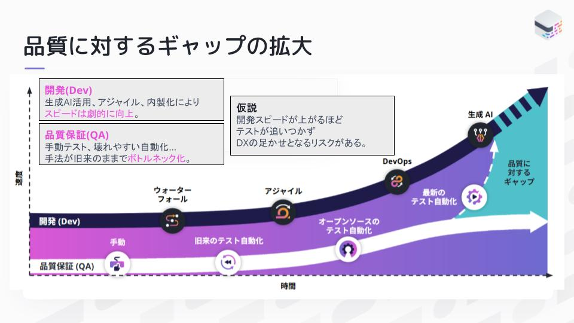
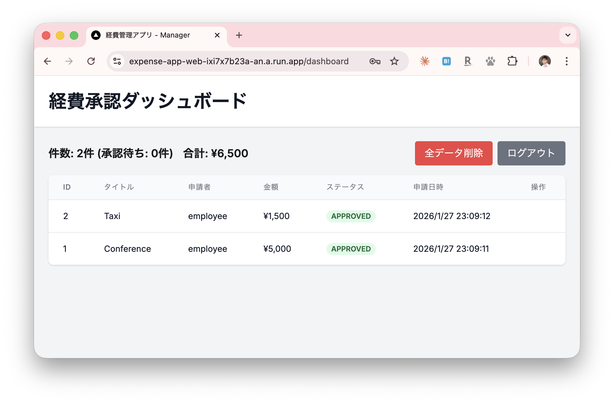
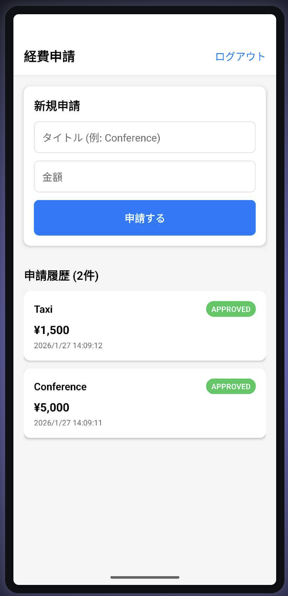
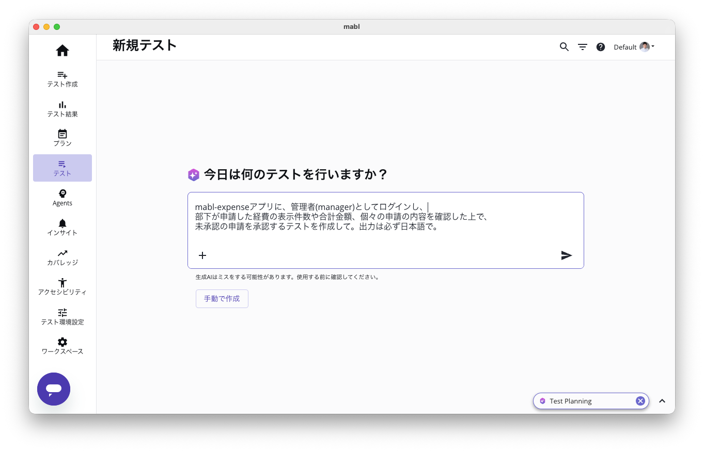
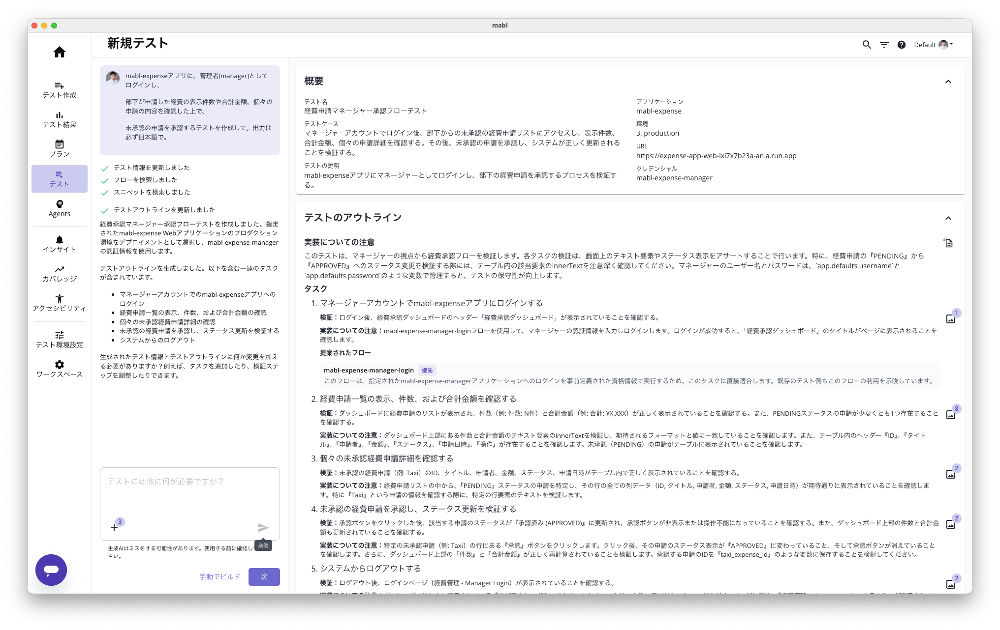
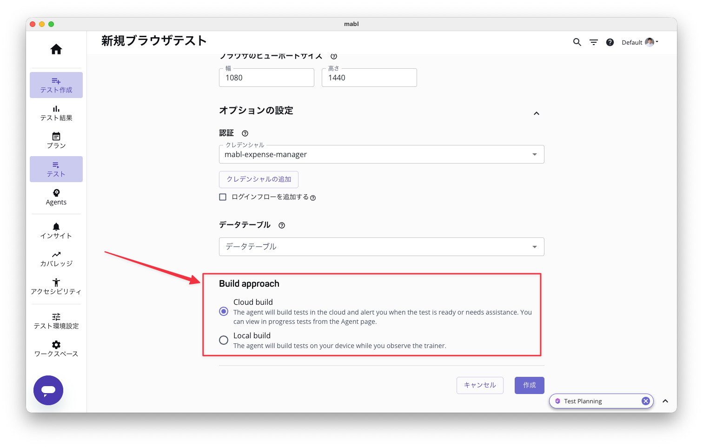

<!-- _class: title-layout -->
<!-- _paginate: false -->
# mabl新機能解説
### プロンプトによるテスト生成と
### ローカル/クラウド実行のシームレスな統合

2026年1月28日（水）13:00〜14:00
舟木将彦（Sales Engineer, mabl）

---
<!-- class: body-layout -->
# 本日のアジェンダ

1. **品質に対するギャップの拡大**
2. **テスト自動化の現状と課題**
3. **AIによるテスト生成の進化**
4. **今回のテスト対象：経費管理アプリ**
5. **自然言語からテストへ**
6. **ローカル実行機能の活用**
7. **クラウドとのシームレスな連携**
8. **CLI/MCPを活用した開発ワークフロー**
9. **デモ**
10. **ベストプラクティス**

---

# 開発スピード vs テスト



**開発(Dev)**
生成AI活用、アジャイル、内製化により
スピードは**劇的に向上**

**品質保証(QA)**
手動テスト、壊れやすい
自動化...
手法が旧来のままで
**ボトルネック化**

---

# テスト自動化の現状と課題

## 従来のテスト作成の課題

- **時間がかかる**: UIテストの作成・メンテナンスに多大な工数
- **専門知識が必要**: セレクタ、待機処理、アサーションの知識
- **メンテナンス負荷**: UIの変更に追従するコスト
- **実行環境の分断**: ローカルとCI/CDで異なる設定

**結果**: テストが後回しになり、品質担保が困難に

---

# テスト自動化の進化

## 従来 → ノーコード → AI時代

| 観点 | 従来（コードベース） | ノーコード | AI時代 |
|------|---------------------|------------|--------|
| **要素特定** | 手動でセレクタを記述 | 操作を記録して自動取得 | 自然言語で意図を伝える |
| **テスト作成** | コードを書いて作成 | 画面操作をキャプチャ | プロンプトから自動生成 |
| **検証方法** | 固定的なアサーション | UIベースの値チェック | AIによる柔軟な検証 |
| **実行環境** | ローカル or クラウド | クラウド中心(スケーラブル) | シームレスな統合 |

**各時代の特徴**
- **従来**: 開発者がコードで自動化（Selenium等）
- **ノーコード**: QAが操作を記録して自動化
- **AI時代**: 意図を伝えてテストを生成 → **Shift Left**

---

# 今回のテスト対象：経費管理アプリ




## アプリ構成

| アプリ | ユーザー | 機能 |
|--------|----------|------|
| **Web** | Manager | 経費一覧の閲覧・承認 |
| **Mobile** | Employee | 経費の申請・履歴確認 |
| **API** | - | データ管理・認証 |

**テストシナリオ**: 従業員が申請 → 管理者が承認 → 従業員が確認

---
<!-- _class: body-compact -->
# 自然言語からテストへ




## プロンプトによるテスト生成

```
mabl-expenseアプリに、管理者(manager)としてログインし、
部下が申請した経費を確認した上で、未承認の申請を承認するテストを作成して
```

↓ mablが自動生成

- ログイン画面で manager / manager123 を入力
- ダッシュボードで経費一覧を表示
- 経費の件数(未承認件数)、合計金額をチェック
- ステータスが PENDING の経費を探す
- 承認ボタンをクリック
- ステータスが APPROVED に変わることを検証

**ポイント**: 業務フローを伝えるだけでテストが完成
**生成AIアサーション**: 件数や金額の検証もAIが自動判定

---

# mablが生成するテストの概要

<div style="text-align: center; margin-top: 20px;">

</div>

---

# テスト生成環境の選択

<div style="text-align: center; margin-top: 20px;">

</div>

---

# MCPによるテスト生成

## Claude Code + mabl MCP

```bash
# テストの計画
mcp__mabl__plan_new_test

# テストの作成
mcp__mabl__create_mabl_test

# ローカルで実行
mcp__mabl__run_mabl_test_local

# クラウドで実行
mcp__mabl__run_mabl_test_cloud
```

**IDE内で完結**: コードを書きながらテストも作成

---

# ローカル実行機能の活用

## 開発中のテスト実行

- **即時フィードバック**: コード変更後すぐにテスト実行
- **デバッグ容易**: ローカル環境でステップ実行
- **コスト効率**: クラウド実行前にローカルで検証
- **オフライン対応**: ネットワーク不要で基本テスト

```bash
# mabl CLIでローカル実行
mabl tests run --id <test-id> --environment <env-id>
```

---

# クラウドとのシームレスな連携

## ローカル → クラウドの統合

```
開発環境（ローカル）
    ↓ テスト作成・デバッグ
    ↓ ローカルで動作確認
    ↓
クラウド実行
    ↓ 複数ブラウザ・デバイス
    ↓ 並列実行
    ↓ スケジュール実行
    ↓
CI/CDパイプライン統合
```

**同じテストをローカルでもクラウドでも実行可能**

---

# CLI/MCPを活用した開発ワークフロー

## 実装とテストの並走

| ステップ | 開発者の作業 | テスト作業 |
|---------|-------------|-----------|
| 1 | 機能の実装 | MCPでテスト計画 |
| 2 | コードレビュー | テスト生成・ローカル実行 |
| 3 | マージ | クラウド実行・CI統合 |
| 4 | デプロイ | 本番監視 |

**ポイント**: テストが開発のボトルネックにならない

---

# デモ：経費管理アプリ

## クロスプラットフォームテスト用デモアプリ

- **マルチアプリ構成**: Web + Mobile + API
- **認証フロー**: 簡易ヘッダー認証
- **data-testid**: mablテスト用セレクタ設計
- **ロール分離**: Manager(Web) / Employee(Mobile)

**テストシナリオ**: Mobile申請 → Web承認 → Mobile確認

---

# デモ：テスト生成フロー

## ライブデモ - 経費承認テスト

1. **プロンプト入力**: 「managerで経費を承認するテスト」
2. **テスト生成**: mablがログイン〜承認のステップを自動生成
3. **ローカル実行**: localhost:3000 で動作確認
4. **調整・修正**: data-testid でセレクタを安定化
5. **クラウド実行**: Chrome / Firefox / Edge で検証

---

# ベストプラクティス

## 実装とテスト作成を並走させるために

1. **data-testidを先に設計**: UI実装前にセレクタを決める
2. **小さなテストから始める**: ログイン→基本操作→複雑なフロー
3. **ローカルで頻繁に実行**: 変更のたびにテストを回す
4. **AIアサーションを活用**: 柔軟な検証で脆いテストを回避
5. **CI/CDに組み込む**: PRごとにテストを自動実行

---

# テスト戦略の分担

## mabl と Playwright の使い分け

| テスト種別 | 推奨ツール | 理由 |
|-----------|-----------|------|
| 経費承認フロー | **mabl** | 実際のAPI・DBを検証 |
| クロスプラットフォーム | **mabl** | Mobile + Web の統合テスト |
| ログイン検証 | Playwright | 高速・ローカル完結 |
| UIレイアウト | Playwright | スナップショット比較 |
| 入力バリデーション | Playwright | クライアント側ロジック |

---

# まとめ

## 本日のポイント

- **プロンプトでテスト生成**: 自然言語からテストを自動作成
- **ローカル実行**: 開発中の即時フィードバック
- **クラウド統合**: シームレスなCI/CD連携
- **MCP活用**: IDE内でテスト作成から実行まで完結
- **並走開発**: 実装とテストを同時に進める新しいワークフロー

**次世代の「Shift Left」で開発者体験を向上**

---

# 参考リソース

## ドキュメント・サポート

| リソース | URL |
|---------|-----|
| mabl ドキュメント | https://help.mabl.com/ |
| mabl CLI | https://help.mabl.com/docs/mabl-cli |
| MCP Server | npmjs.com/@anthropics/mcp-server-mabl |
| 経費管理デモアプリ | github.com/mfunaki/my-mabl-demo-app |

**サポート**: support@mabl.com

---
<!-- _class: blank-layout -->
<!-- _paginate: false -->
# ご清聴ありがとうございました！
